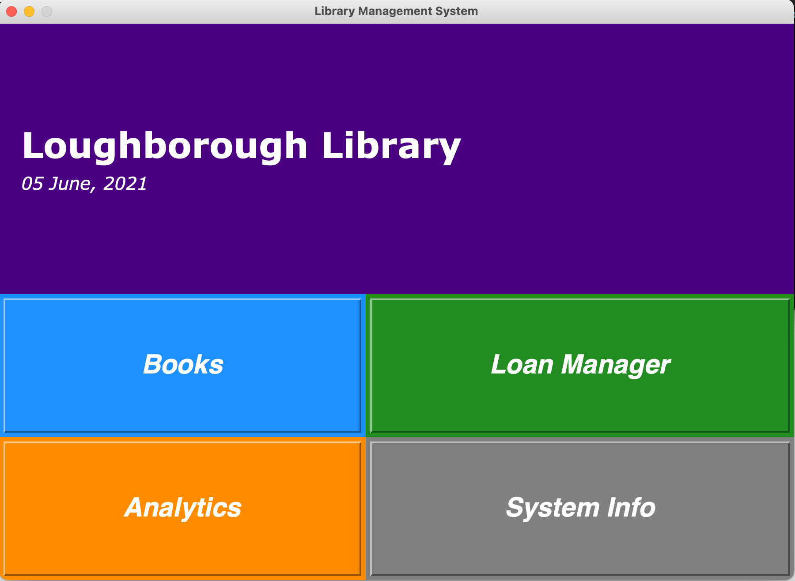
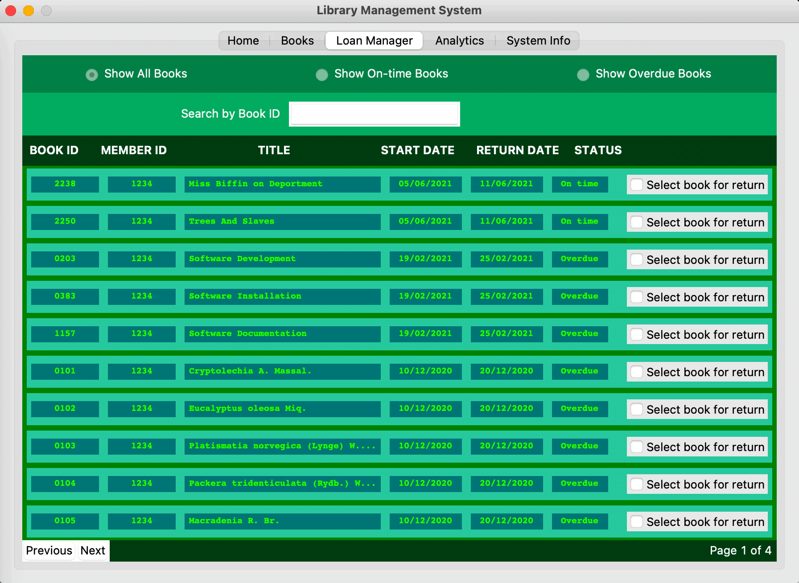
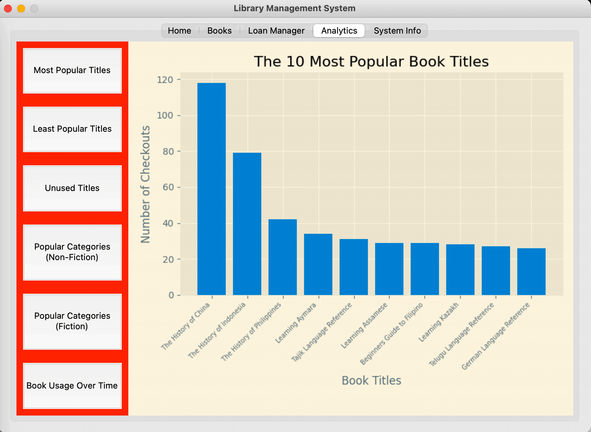

# Loughborough Library
A simple library book management system built with python and the tkinter library.

## Getting Started
### Installation
- Clone this repository by running the terminal command `git clone git@github.com:bheki-maenetja/lboro-library.git`
- In the root folder run the terminal command `pipenv shell`
- In the root folder run the terminal command `pipenv install` to install all necessary packages and modules

### Deployment
- To run the game locally enter `python menu.py` in the terminal

## Technology Used
- Python 3
- Tkinter library 
- Pipenv

## Overview
Loughborough Library is a simple library book management system built primarily in python with the use of the Tkinter GUI library. The system allows users to search for books either by title of by category/genre. Additionally, books can be loaned out and returned to the library. The user can keep track of books that are out on loan or overdue. Users can also view analytics relating to book usage in the library (for instance the user can view the most popular genres or the number of books loaned out per year). This project was originally a coursework assignment for the Introduction to Programming module in [Loughborough University](https://www.lboro.ac.uk/)'s undergraduate Computer Science [course](https://www.lboro.ac.uk/study/undergraduate/courses/a-z/computer-science-bsc/).

<figcaption>The Home Page</figcaption>


<figcaption>Users can search for books and loan them out</figcaption>


<figcaption>Users can see which books are on loan and overdue</figcaption>


<figcaption>Users can view visualisations of book usage data</figcaption>


## Developmemt
The project was developed over the course of 4 weeks. This project was originally a coursework assignment for the Introduction to Programming module in [Loughborough University](https://www.lboro.ac.uk/)'s undergraduate Computer Science [course](https://www.lboro.ac.uk/study/undergraduate/courses/a-z/computer-science-bsc/). It was the final project for the module, counting for 80% of the module's marks. The project acheived a final grade of 98%.

### Design Pattern
- The applications uses a standard Model-View-Controller design pattern with the model and view code residing in `database.py` and `menu.py` respectively. The controller code sits in several files in the folder titled `operations`.

```
# Code for the major GUI components and home page
# The use of classes would have made this far simpler but it was prohibited as part of the assignment

# ====================== MAIN WINDOW & GLOBAL VARIABLES ======================  
## Window Setup ==============================================================
root = tk.Tk()
root.title('Library Management System')
root.geometry('900x630')
root.resizable(False, False)

## Global Variables ==========================================================
page_manager = dict()

# ============================= UTILITY FUNCTIONS ============================ 
def alert(message, is_error=True):
    """
    WHAT DOES THIS FUNCTION DO?
        * this function displays pop up message that can indicate an error or confirmation
    """
    if is_error:
        messagebox.showwarning(message=message)
    else:
        messagebox.showinfo(message=message)

def format_text(input_str, standard_length):
    """
    WHAT DOES THIS FUNCTION DO?
        * this formats a given string to ensure that it has a standard length
    """
    str_len = len(input_str)
    if str_len == standard_length:
        return input_str
    elif str_len > standard_length:
        return input_str[:standard_length - 3] + "..."
    elif str_len < standard_length:
        return input_str + " "*(standard_length - str_len)

def validate_numeric_entry(val):
    """
    WHAT DOES THIS FUNCTION DO?
        * this functions ensure that the value entered into an entry is numeric
    """
    return re.match('^[0-9]*$', val) is not None and len(val) < 5

# ============================== PAGE CONTAINER ==============================
## The Main Page Container ===================================================
def build_page_container():
    """
    WHAT DOES THIS FUNCTION DO?
        * builds the notebook that contains the books, loan manager and system info pages
    """
    page_notebook = ttk.Notebook(master=root)
    page_notebook.add(tk.Frame(), text="Home")

    books_page = build_books_page(page_notebook)
    loan_manager_page = build_loan_manager_page(page_notebook)
    analytics_page = build_analytics_page(page_notebook)
    system_info_page = build_system_info_page(page_notebook)

    page_notebook.add(books_page, text="Books")
    page_notebook.add(loan_manager_page, text="Loan Manager")
    page_notebook.add(analytics_page, text="Analytics")
    page_notebook.add(system_info_page, text="System Info")

    page_notebook.bind('<<NotebookTabChanged>>', lambda e: page_change())

    return page_notebook

# ================================= HOME PAGE ================================
## Home Page UI Components ===================================================
def build_home_page():
    """
    WHAT DOES THIS FUNCTION DO?
        * builds the home page
    """
    home_frame = tk.Frame(master=root, height=100, width=100)
    home_frame.columnconfigure(0, weight=1, minsize=root.winfo_height())
    home_frame.rowconfigure(0, weight=1, minsize=root.winfo_width())
    home_frame.rowconfigure(1, weight=1, minsize=root.winfo_width())

    hero_section = build_hero_section(home_frame)
    button_section = build_button_section(home_frame)
    hero_section.grid(row=0, column=0, sticky="nesw")
    button_section.grid(row=1, column=0, sticky="nesw")

    return home_frame

def build_hero_section(master_frame):
    """
    WHAT DOES THIS FUNCTION DO?
        * builds the top section of the home page
    """
    hero_section = tk.Frame(master=master_frame, bg="#4B0082")
    hero_section.rowconfigure(0, weight=1, minsize=root.winfo_width())
    hero_section.rowconfigure(1, weight=1, minsize=root.winfo_width())
    hero_section.columnconfigure(0, weight=1, minsize=root.winfo_height())

    heading_font = tkFont.Font(family="Verdana", size=40, weight="bold")
    sub_heading_font = tkFont.Font(family="Verdana", size=20, slant="italic")

    heading = tk.Label(
        master=hero_section, 
        text="Loughborough Library", 
        font=heading_font, 
        bg="#4B0082", 
        fg="white"
    )

    sub_heading = tk.Label(
        master=hero_section, 
        text=f"{dt.strftime(dt.now(), '%d %B, %Y')}", 
        font=sub_heading_font, 
        fg="white",
        bg="#4B0082", 
    )

    heading.grid(row=0, column=0, sticky="ws", padx=20)
    sub_heading.grid(row=1, column=0, sticky="wn", padx=20)

    return hero_section

def build_button_section(master_frame):
    """
    WHAT DOES THIS FUNCTION DO?
        * builds the bottom section of the home page
    """
    button_section = tk.Frame(master=master_frame, bg="#4B0082")
    button_info = [
        ('Books', '#1E90FF', lambda e: transition(pages_index=1)), 
        ('Loan Manager', '#228B22', lambda e: transition(pages_index=2)), 
        ('Analytics', '#FF8C00', lambda e: transition(pages_index=3)), 
        ('System Info', 'grey', lambda e: transition(pages_index=4))
    ]
    button_font = tkFont.Font(family="helvetica", size=30, weight="bold", slant="italic")

    for i in range(2):
        button_section.columnconfigure(i, weight=1, minsize=25)
        button_section.rowconfigure(i, weight=1, minsize=25)
        for j in range(2):
            new_button_info = button_info[j + i * 2]
            new_button = tk.Label(
                button_section, 
                text=new_button_info[0], 
                font=button_font, 
                bg=new_button_info[1], 
                highlightthickness=5, 
                fg="white", 
                relief=tk.RAISED
            )
            new_button.bind('<Button-1>', new_button_info[2])
            new_button.grid(row=i, column=j, sticky="nesw")
    
    return button_section

## Home Page Functionality ===================================================
page_manager['home_page'] = build_home_page()

```

### Book and Log Data
- All the data that the program handles are stored in text files. Data about each individual book is stored in `database.txt`. Log data (where a log is a record of a book being checked out or returned) is stored in `logfile.txt`. 
- Both `database.txt` and `logfile.txt` sit in the folder titled `system_data`. Copies of both files sit in the root of the project; these files are used as backups and can also be used to provide seed data for the application.

```
# Model code for handling book data 

# ============================= GLOBAL VARIABLES =============================
dir_path = os.path.dirname(os.path.realpath(__file__))
database_file = os.path.join(dir_path, "database.txt")
log_file = os.path.join(dir_path, "logfile.txt")

# =================================== BOOKS ==================================
## Getting & Updating Books from file ========================================
def get_all_books():
    """
    PARAMATERS
        * None
    RETURN VALUES
        * a list of dictionaries with each dictionary holding information about an indivdual book
    WHAT DOES THIS FUNCTION DO?
        * This function retrieves all book information in the database.txt file and returns it as a list
    """
    try:
        database = open(database_file, "r")
        return [json.loads(book) for book in database]
    except:
        print('Something went wrong...')
    database.close()

def get_book_by_id(book_id):
    """
    PARAMATERS
        * book_id -> an integer representing the unique identifier of a book
    RETURN VALUES
        * a single dictionary that holds information about a particular book
    WHAT DOES THIS FUNCTION DO?
        * This function locates the information of an indivdual book in the database and returns it
    """
    try:
        book_str = linecache.getline(database_file, book_id)
        return json.loads(book_str)
    except:
        print('something went wrong...')

def update_book(book_id, book_obj):
    """
    PARAMATERS
        * book_id -> an integer representing the unique identifier of a book
        * book_obj -> a dictionary with the newly updated information of a book
    RETURN VALUES
        * None
    WHAT DOES THIS FUNCTION DO?
        * This function locates a book in the database and updates its information
    """
    try:
        for book in fileinput.input(database_file, inplace=True):
            book_dict = json.loads(book)
            if book_dict['id'] == book_id:
                print(json.dumps(book_obj))
            else:
                print(json.dumps(book_dict))
    except:
        print('Error -- Could not update book record')

```

### Project Constraints
- It should be noted that while this project was being developed as a coursework assignment the use of custom classes was prohibited; this effected the program code - particulary the code for the GUI - making it necessarily more verbose.

## Reflection

